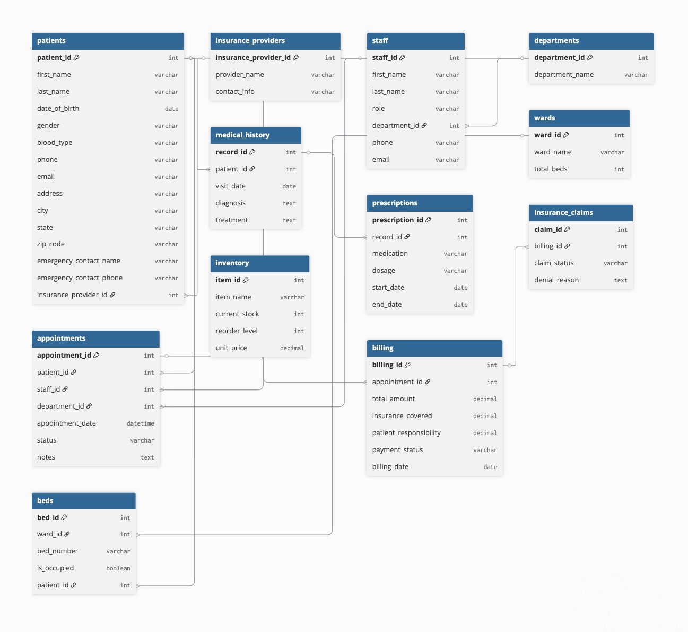

# <p align="center">🏥 SQL: Hospital Management System 🧬<p/>
<br>**Nattawut Boonnoon**<br/>
💼 LinkedIn: www.linkedin.com/in/nattawut-bn
<br>📧 Email: nattawut.boonnoon@hotmail.com<br/>
📱 Phone: (+66) 92 271 6680

***📋 Overview***
-
My personal project is building a functional hospital management database using MySQL that tackles three operational challenges in modern healthcare facilities:

1. Patient Care Workflows = Tracks patient admissions, appointments, treatments, and medical histories in real-time to reduce wait times and improve care coordination.
2. Resource Allocation = Manages doctors, nurses, equipment, and room assignments to maximize utilization and minimize operational bottlenecks.
3. Financial Operations = Monitors billing, insurance claims, and payment processing to reduce revenue leakage and improve cash flow.

**Why It Matters:** Hospitals struggle with fragmented data systems that lead to scheduling conflicts, unused resources, and billing errors costing millions annually. I hope this database acts as a centralized backbone example, giving administrators clear visibility into operations so they can make better decisions that directly impact outcomes.

***⭐ Database Architecture***
-
**📂 Modules:**
- Patient Management: Complete demographics, medical records, and insurance information.
- Appointment Scheduling: A collaborative department scheduling system with status tracking.
- Staff management includes personnel data, department duties, and performance indicators
- Billing & Insurance: Financial transactions, insurance claims, and payment tracking.
- Ward/Bed Management: Real-time bed occupancy and patient admission procedures.
- Inventory Management: Track medical supplies with automated reorder alerts.

**📊 Statistics:**

- 13 Interconnected Tables
- 150 Patient Records
- 250 Staff Members (Doctors, Nurses, Administrative Staff, Technicians)
- 1,000 Appointments
- 5,000 Medical History Records
- 3,500 Prescriptions
- 180 Hospital Beds across 12 wards
- ~1,000 Billing Transactions

***🗂️ Relationship Diagram***
-


***🎯 Problem-Solving Approach***
-
| Issues | SQL solution | Business Impact |
| :---------- | :-----------: | -----------: |
| 30-Day Readmission Tracking | Window function (LEAD) to identify readmission patterns | Lowers CMS penalties, better discharge planning |
| Doctor Workload Monitoring | Ranked appointment counts with LIMIT | Protects burnout, balances schedules |
| Insurance Claim rejects | Multi-level CTE analysis of denial patterns | Recovers lost revenue, improves submission accuracy |
| Medication Stockouts | Subquery-based threshold alerts | Confirms medication availability, reduces waste |
| Patient Payment Collection | Cohort comparison using UNION | Finding at-risk accounts, improves cash flow |
| Appointment NOT showing | CASE-based percentage calculations | Controls wasted slots, better decision-making | 

# <p align="center">📥 Sample Queries 📊<p/>
**Prerequisites:**

https://www.mysql.com/
- MySQL 8.0 or higher (Some functions won't work if lower than 8.0.)
- At least 500MB free disk space.
- SQL Knowledges

**Installation:**
1. Clone the Repository
   `````bash
   git clone https://github.com/yourusername/hospital-management-system.git
   cd hospital-management-system
   `````
2. Create the Database
   `````bash
   mysql -u root -p < schema/Nattawut_HMS_Schema.sql
   `````
3. Load Sample Data
   `````bash
   # Place all CSV files from data/ folder in MySQL's secure file directory
   # Then run the LOAD DATA commands in Nattawut_HMS_Schema.sql
   # Or manually import CSVs using your MySQL client
   `````
4. Run Sample Queries
   `````bash
   mysql -u root -p hospital_management < queries/Nattawut_HMS_Analytics.sql
   `````

***💉 Basic Level***
-
**Query Example: Patient Emergency Contact Lookup**
- PROBLEM: ER needs immediate patient contact info for unconscious patients
- WHY IT MATTERS: Delays in contacting family can complicate critical care decisions
- SOLUTION: Fast lookup by patient ID with emergency contact details
`````sql
SELECT 
    patient_id,
    CONCAT(first_name, ' ', last_name) AS patient_name,
    date_of_birth,
    TIMESTAMPDIFF(YEAR, date_of_birth, CURDATE()) AS age,
    gender,
    blood_type,
    phone AS patient_phone,
    emergency_contact_name,
    emergency_contact_phone,
    CONCAT(address, ', ', city, ', ', state, ' ', zip_code) AS full_address
FROM 
    patients
WHERE 
    patient_id = 25  -- Replace with actual patient ID now
ORDER BY 
    patient_id;
`````

***💊 Intermediate Level***
-
**Query Example: Department Revenue Analysis (Last Quarter)**
- PROBLEM: Financial planning needs to know which departments drive revenue
- WHY IT MATTERS: Revenue data guides hiring, equipment purchases, and service expansion
- SOLUTION: Sum billing amounts by department using subquery

`````sql
SELECT 
    d.department_name,
    COUNT(DISTINCT a.appointment_id) AS total_appointments,
    SUM(b.total_amount) AS total_revenue,
    SUM(b.insurance_covered) AS insurance_payments,
    SUM(b.patient_responsibility) AS patient_payments,
    ROUND(AVG(b.total_amount), 2) AS avg_transaction,
    SUM(CASE WHEN b.payment_status = 'Paid' THEN b.patient_responsibility ELSE 0 END) AS collected,
    SUM(CASE WHEN b.payment_status = 'Pending' THEN b.patient_responsibility ELSE 0 END) AS outstanding
FROM 
    departments d
    INNER JOIN appointments a ON d.department_id = a.department_id
    INNER JOIN billing b ON a.appointment_id = b.appointment_id
WHERE 
    b.billing_date >= DATE_SUB(CURDATE(), INTERVAL 3 MONTH)
GROUP BY 
    d.department_id, d.department_name
HAVING 
    total_revenue > 0
ORDER BY 
    total_revenue DESC;
`````

***⚕️ Advanced Level***
-
**Query Example: Patients With vs Without Insurance (UNION)**
- PROBLEM: Uninsured patients have different billing and care coordination needs
- WHY IT MATTERS: Uninsured patients are 3x more likely to have unpaid balances
- SOLUTION: Compare two patient cohorts using UNION

`````sql
SELECT 
    'Insured Patients' AS patient_group,
    COUNT(DISTINCT p.patient_id) AS total_patients,
    COUNT(a.appointment_id) AS total_appointments,
    ROUND(AVG(b.total_amount), 2) AS avg_bill_amount,
    SUM(CASE WHEN b.payment_status = 'Paid' THEN 1 ELSE 0 END) AS paid_bills,
    SUM(CASE WHEN b.payment_status IN ('Pending', 'Overdue') THEN 1 ELSE 0 END) AS unpaid_bills,
    ROUND((SUM(CASE WHEN b.payment_status = 'Paid' THEN 1 ELSE 0 END) * 100.0 / 
           COUNT(b.billing_id)), 2) AS payment_rate
FROM 
    patients p
    LEFT JOIN appointments a ON p.patient_id = a.patient_id
    LEFT JOIN billing b ON a.appointment_id = b.appointment_id
WHERE 
    p.insurance_provider_id IS NOT NULL

UNION ALL

SELECT 
    'Uninsured Patients' AS patient_group,
    COUNT(DISTINCT p.patient_id),
    COUNT(a.appointment_id),
    ROUND(AVG(b.total_amount), 2),
    SUM(CASE WHEN b.payment_status = 'Paid' THEN 1 ELSE 0 END),
    SUM(CASE WHEN b.payment_status IN ('Pending', 'Overdue') THEN 1 ELSE 0 END),
    ROUND((SUM(CASE WHEN b.payment_status = 'Paid' THEN 1 ELSE 0 END) * 100.0 / 
           COUNT(b.billing_id)), 2)
FROM 
    patients p
    LEFT JOIN appointments a ON p.patient_id = a.patient_id
    LEFT JOIN billing b ON a.appointment_id = b.appointment_id
WHERE 
    p.insurance_provider_id IS NULL;
`````

# <p align="center">🎓 Key Learning Outcomes 📚<p/>

**Technical Expertise:**

- ✅ Database normalization (3NF)
- ✅ Complex JOIN operations (INNER, LEFT)
- ✅ Window functions (LEAD for time-series analysis)
- ✅ Common Table Expressions (CTEs) for query organization
- ✅ Set operators (UNION for cohort comparison)
- ✅ Date/time manipulation and calculations
- ✅ Conditional aggregation with CASE statements
- ✅ Subqueries and correlated subqueries
- ✅ Performance optimization with indexes
- ✅ Data integrity with constraints (CHECK, FOREIGN KEY)

**Business Acumen:**

- 📈 Healthcare quality metrics (readmission rates, length of stay)
- 💰 Revenue cycle management (claims, denials, collections)
- 🏥 Clinical workflows (admissions, discharges, prescriptions)
- 👥 Resource optimization (staff workload, bed capacity, inventory)
- 📊 Operational analytics for decision-making

**Acknowledgments:**

- 🚑 Healthcare domain knowledge inspired by real-world hospital systems
- 👨🏼‍⚕️ SQL best practices from industry standards
- 👩🏼‍⚕️ Database design principles following E.F. Codd's relational model
